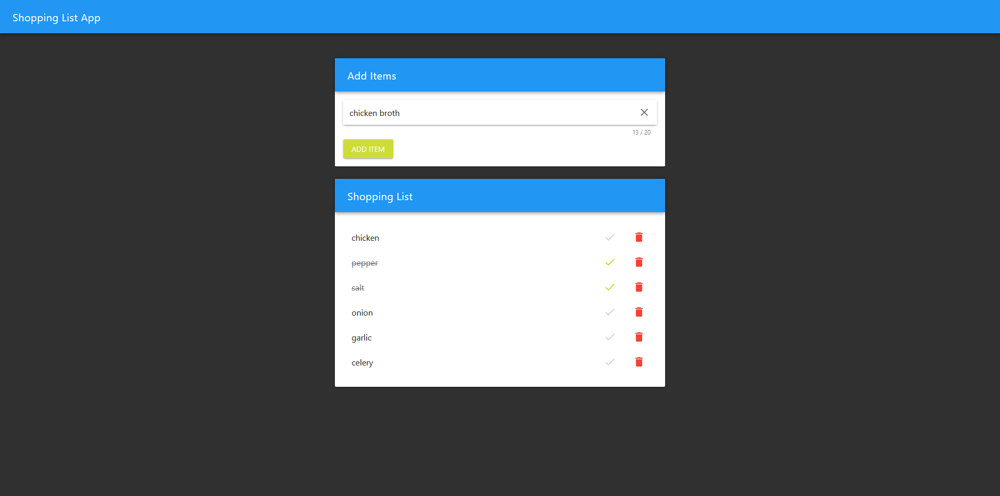

# Shopping List Vue.js Application

## Screenshots

### Desktop View



## todo

- implement ability to edit items
- add fields for quantity
- save data in JSON format, export that JSON to CSV

## Project setup

``` sh
npm install
```

### Compiles and hot-reloads for development

``` sh
npm run serve
```

### Compiles and minifies for production

``` sh
npm run build
```

### Run your tests

``` sh
npm run test
```

### Lints and fixes files

``` sh
npm run lint
```

### Customize configuration

See [Configuration Reference](https://cli.vuejs.org/config/).
